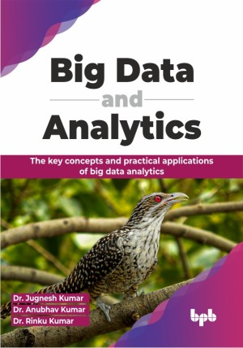

# Big Data and Analytics

Unveiling insights, unleashing potential: Navigating the depths of big data and analytics for a data-driven tomorrow

This is the repository for [Big Data and Analytics
](https://bpbonline.com/products/big-data-and-analytics?variant=43285399699656),published by BPB Publications.

## About the Book
Big data and analytics is an indispensable guide that navigates the complex data management and analysis. This comprehensive book covers the core principles, processes, and tools, ensuring readers grasp the essentials and progress to advanced applications.

It will help you understand the different analysis types like descriptive, predictive, and prescriptive. Learn about NoSQL databases and their benefits over SQL. The book centers on Hadoop, explaining its features, versions, and main components like HDFS (storage) and MapReduce (processing). Explore MapReduce and YARN for efficient data processing. Gain insights into MongoDB and Hive, popular tools in the big data landscape.

## What You Will Learn
• Grasp big data fundamentals and applications.

• Master descriptive, predictive, and prescriptive analytics.

• Understand HDFS, MapReduce, YARN, and their functionalities.

• Explore data storage, retrieval, and manipulation in a NoSQL database.

• Gain practical insights and apply them to real-world scenarios.
